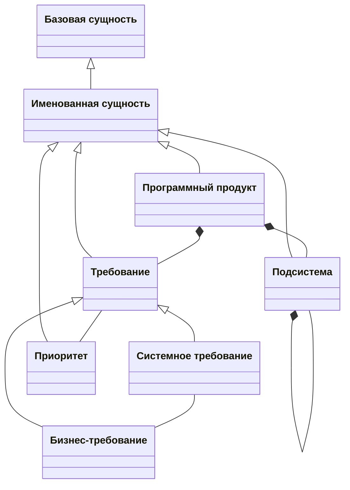

# Описание модели данных «Архитектура программного продукта»

## Типы данных

| Тип данных | Название (англ.) |
| ---------- | ---------------- |
| Логическое значение | boolean |
| Строка (100) | string100 |
| Строка (1000) | string1000 |
| UUID | UUID |
| Порядковый номер | ordinal |
| Человеко-час | man-hour |
| Текст | text |

## Базовая сущность (persistent entity)

| Атрибут или ссылка | Название (англ.) | Тип данных | Мн. |
| ------------------ | ---------------- | ---------- | :-: |
| Идентификатор | id | [UUID](#типы-данных) | 1 |

## Именованная сущность (named entity)

| Атрибут или ссылка | Название (англ.) | Тип данных | Мн. |
| ------------------ | ---------------- | ---------- | :-: |
| Идентификатор | id | [UUID](#типы-данных) | 1 |
| Название | name | [строка (100)](#типы-данных) | 1 |
| Описание | description | [строка (1000)](#типы-данных) | 0..1 |

## Программный продукт (software)

| Атрибут или ссылка | Название (англ.) | Тип данных | Мн. |
| ------------------ | ---------------- | ---------- | :-: |
| Идентификатор | id | [UUID](#типы-данных) | 1 |
| Название | name | [строка (100)](#типы-данных) | 1 |
| Описание | description | [строка (1000)](#типы-данных) | 0..1 |

## Подсистема (subsystem)

| Атрибут или ссылка | Название (англ.) | Тип данных | Мн. |
| ------------------ | ---------------- | ---------- | :-: |
| Идентификатор | id | [UUID](#типы-данных) | 1 |
| Название | name | [строка (100)](#типы-данных) | 1 |
| Описание | description | [строка (1000)](#типы-данных) | 0..1 |
| Дочерние подсистемы | children | [подсистема](#подсистема-subsystem) | 0..* |
| Родительская подсистема | parent | [подсистема](#подсистема-subsystem) | 0..1 |

## Требование (requirement)

| Атрибут или ссылка | Название (англ.) | Тип данных | Мн. |
| ------------------ | ---------------- | ---------- | :-: |
| Идентификатор | id | [UUID](#типы-данных) | 1 |
| Название | name | [строка (100)](#типы-данных) | 1 |
| Описание | description | [строка (1000)](#типы-данных) | 0..1 |
| Трудозатраты | effort | [человеко-час](#типы-данных) | 0..1 |
| Приоритет | priority | [приоритет](#приоритет-priority) | 0..1 |

## Бизнес-требование (business requirement)

| Атрибут или ссылка | Название (англ.) | Тип данных | Мн. |
| ------------------ | ---------------- | ---------- | :-: |
| Идентификатор | id | [UUID](#типы-данных) | 1 |
| Название | name | [строка (100)](#типы-данных) | 1 |
| Описание | description | [строка (1000)](#типы-данных) | 0..1 |
| Трудозатраты | effort | [человеко-час](#типы-данных) | 0..1 |
| Приоритет | priority | [приоритет](#приоритет-priority) | 0..1 |
| Системные требования | system requirements | [системное требование](#системное-требование-system-requirement) | 0..* |

## Системное требование (system requirement)

| Атрибут или ссылка | Название (англ.) | Тип данных | Мн. |
| ------------------ | ---------------- | ---------- | :-: |
| Идентификатор | id | [UUID](#типы-данных) | 1 |
| Название | name | [строка (100)](#типы-данных) | 1 |
| Описание | description | [строка (1000)](#типы-данных) | 0..1 |
| Трудозатраты | effort | [человеко-час](#типы-данных) | 0..1 |
| Пользовательский сценарий | user scenario | [текст](#типы-данных) | 0..1 |
| Бизнес-требования | business requirements | [бизнес-требование](#бизнес-требование-business-requirement) | 0..* |
| Приоритет | priority | [приоритет](#приоритет-priority) | 0..1 |

## Приоритет (priority)

| Атрибут или ссылка | Название (англ.) | Тип данных | Мн. |
| ------------------ | ---------------- | ---------- | :-: |
| Идентификатор | id | [UUID](#типы-данных) | 1 |
| Название | name | [строка (100)](#типы-данных) | 1 |
| Описание | description | [строка (1000)](#типы-данных) | 0..1 |
| Порядковый номер | ordinal | [порядковый номер](#типы-данных) | 1 |
